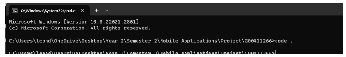
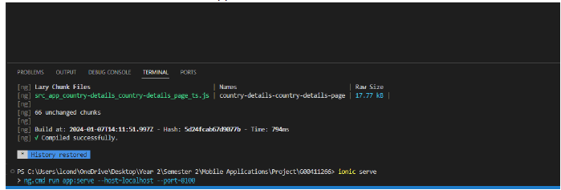
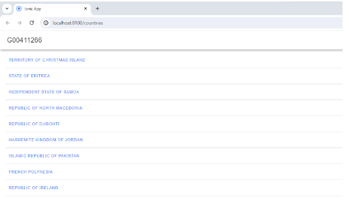
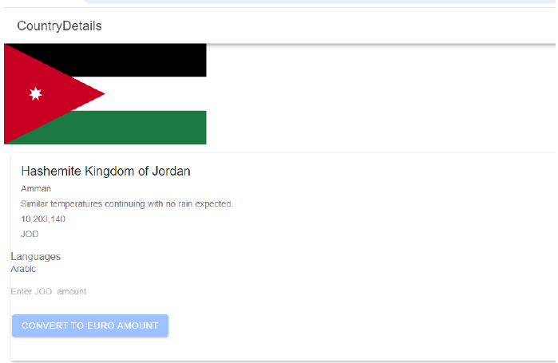

## Ionic Countries API

### **About the Project**
Aim of the project was to provide the country information using the restcountries.com API, which would also give you the information of the weather in that particular country and the amount of currency converted to Euro

### **Project Details**
- Information on any selected country
- Population of the country
- Weather in that particular country
- Currency of that particular country

### Tools used ###
- Ionic Framework
- Typescript 
- Angular
- RestAPI

#### Instructions to run the Programme:
1.	Use the cmd command on the project folder and enter in code . which will bring you into the code environment

2.	Run Ionic serve in VS code to run the application in a webserver

!
3.	Click into any of the countries and it will provide the country details of that particular country

The design of the programme I used three classes:

1.	The Server Class – to set up the Server and the port to be used for when clients are looking to join 
2.	The Client Class -  to set up clients that can access the server, let them type in their names, allow them to write messages on the server, by using Threads with Client Handler
3.	The ClientHandler Class – to set up the threads, allow the messages from the clients be read in the server by using a BufferedReader
